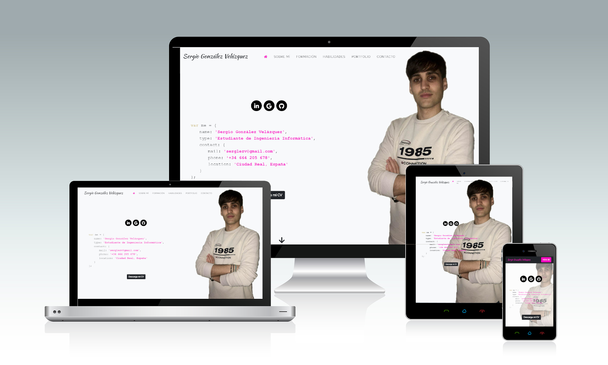

# Página web personal
>Página web personal en la que describo mi formación y habilidades, adjunto mi curriculum y proporciono información de contacto.
>Puede visitarse en http://sergiogonzalezvelazquez.github.io/

---

## Posicionamiento :chart_with_upwards_trend:
He intentado mejorar el posicionamiento SEO aplicando los contenidos vistos en la asignatura de __Comercio Electrónico__. En este sentido, he tomado las siguientes decisiones:
* Uso de __Google Analytics__  para tener información de la audiencia del sitio.
* Uso de __Google Search Console__ para comprobar el estado de indexación del sitio. 
* He incluído un archivo __robots.txt__ para proporcionar información a los motores de búsqueda
* He añadido un __sitemap__ para facilitar el rastreo de la página a los buscadores.

## Herramientas ⚙️
* HTML5
* Hojas de estilos CSS
* Javascript
* JQuery
* Bootstrap 4